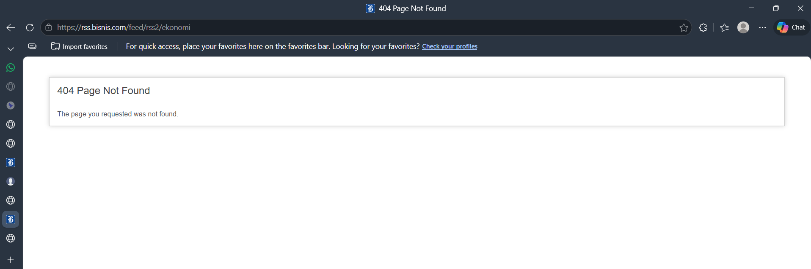
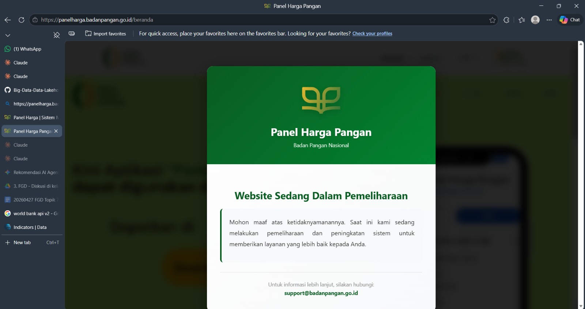
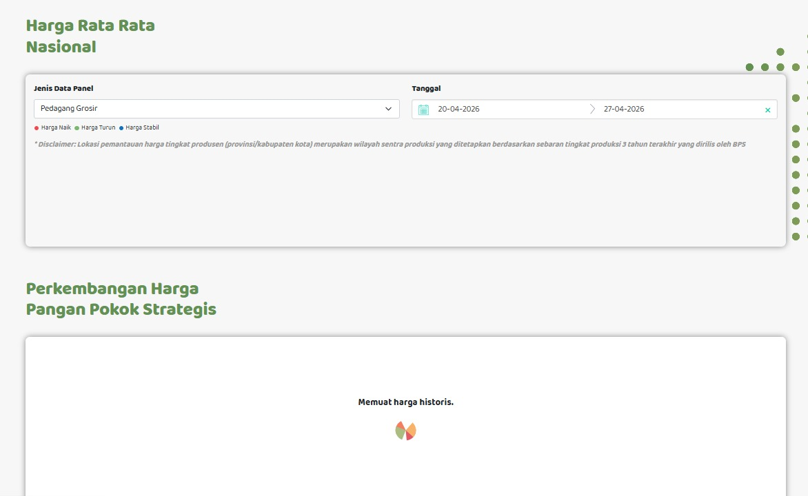
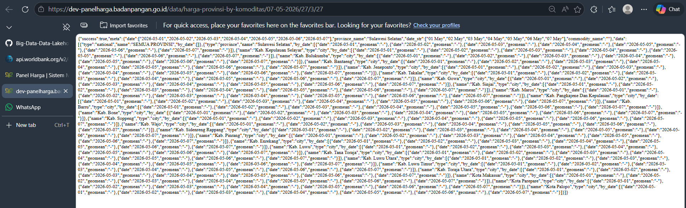
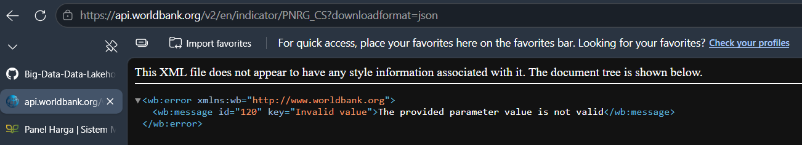

# HargaPangan Monitor — Big Data Pipeline

**ETS Mata Kuliah Big Data** | Sistem monitoring harga komoditas bahan pokok Indonesia menggunakan arsitektur Big Data end-to-end.

---

## Anggota Tim

| NRP | Nama | Peran |
| --- |------|-------|
| 5027231007 | Thio Billy | Producer API |
| 5027241026 | Evan Christian Nainggolan | Spark Analysis |
| 5027241039 | Rayka Dharma Pranandita | DevOps + Dashboard |
| 5027241044 | Rizqi Akbar | Producer RSS + Consumer |

---

## Topik & Justifikasi

**Topik:** HargaPangan — Monitor Harga Komoditas Bahan Pokok Indonesia

**Pertanyaan Bisnis:**
"Komoditas mana yang paling bergejolak harganya hari ini, dan apakah ada berita ekonomi yang menjelaskan penyebabnya?"

**Justifikasi sumber data:**

- Producer API menggunakan simulator realistis dengan model random walk berbasis harga pasar riil Indonesia (April 2026). Hal ini dilakukan karena API harga pangan publik tidak menyediakan endpoint yang stabil dan terdokumentasi untuk akses terprogram.
- Producer RSS menggunakan feed Bisnis.com dan Kompas.com (kategori ekonomi/money) sebagai sumber berita pangan secara real-time.

---

## Arsitektur Sistem

Alur data dalam pipeline:

1. Producer menghasilkan data dan mengirimkannya ke Kafka.
2. Consumer membaca dari Kafka dan secara real-time menulis ke file JSON lokal agar dapat dibaca langsung oleh Dashboard.
3. Consumer juga melakukan batching data dan menyimpannya ke HDFS.
4. Spark memproses data batch dari HDFS untuk menghasilkan analitik.
5. Dashboard membaca file JSON lokal (real-time data) dan hasil analisis Spark.

```text
  PRODUCERS (pipeline/producer_api.py, pipeline/producer_rss.py)
       |
       v
  Apache Kafka (KRaft Mode, localhost:9092)
       |
       v
  Consumer (pipeline/consumer_to_hdfs.py)
       |--------------------------------\
       v                                v
  HDFS (Batch per N pesan)      Local JSON (Real-time update)
       |                                |
       v                                |
  Spark Analysis (spark/analysis.py)    |
       |                                |
       v                                |
  Flask Dashboard (dashboard/app.py) <--/
```

---

## Cara Menjalankan

### Prasyarat

- Docker Desktop (min. RAM 6GB dialokasikan)
- Python 3.12 atau yang lebih baru
- pip

### 1. Install Python Dependencies

Sistem menggunakan `kafka-python-ng` untuk kompatibilitas dengan Python versi terbaru.

```bash
pip install -r requirements.txt
```

### 2. Start Hadoop Cluster

```bash
docker compose -f docker-compose-hadoop.yml up -d
```

Verifikasi:

- HDFS Web UI: <http://localhost:9870>
- Pastikan container namenode berjalan: `docker ps | findstr namenode`

Buat direktori HDFS untuk data:

```bash
docker exec namenode hdfs dfs -mkdir -p /data/pangan/api
docker exec namenode hdfs dfs -mkdir -p /data/pangan/rss
docker exec namenode hdfs dfs -mkdir -p /data/pangan/hasil
docker exec namenode hdfs dfs -chmod -R 777 /data/pangan
```

### 3. Start Kafka

```bash
docker compose -f docker-compose-kafka.yml up -d
```

Verifikasi:

- Kafka UI: <http://localhost:8080>
- Pastikan broker berjalan: `docker ps | findstr kafka-broker`

### 4. Jalankan Pipeline (di terminal terpisah)

Karena sistem berjalan secara terus-menerus, buka terminal baru untuk masing-masing perintah berikut:

**Terminal 1 — Consumer HDFS:**

```bash
$env:PYTHONUTF8=1; python pipeline/consumer_to_hdfs.py
```

**Terminal 2 — Producer API:**

```bash
$env:PYTHONUTF8=1; python pipeline/producer_api.py
```

**Terminal 3 — Producer RSS:**

```bash
$env:PYTHONUTF8=1; python pipeline/producer_rss.py
```

*(Catatan: flag `$env:PYTHONUTF8=1` ditambahkan khusus untuk Windows PowerShell agar tidak terjadi error Unicode)*

### 5. Jalankan Spark Analysis

Tunggu beberapa saat hingga data terkumpul di HDFS dari consumer, kemudian jalankan:

```bash
python spark/analysis.py
```

*(Catatan: Proses ini dapat dijalankan secara berkala untuk memperbarui hasil analitik)*

### 6. Jalankan Flask Dashboard

**Terminal 4:**

```bash
python dashboard/app.py
```

Buka browser dan akses: **<http://localhost:5000>**

---

## Struktur Proyek

```text
ets/
├── hadoop.env                    # Konfigurasi Hadoop environment
├── docker-compose-hadoop.yml     # Hadoop HDFS/YARN (4 container)
├── docker-compose-kafka.yml      # Kafka KRaft + Kafka UI
├── requirements.txt              # Python dependencies
├── .gitignore
│
├── kafka/
│   ├── producer_api.py           # Simulator harga komoditas (Billy)
│   ├── producer_rss.py           # RSS feed reader (Akbar)
│   └── consumer_to_hdfs.py       # Consumer -> HDFS & Local JSON (Akbar)
│
├── spark/
│   └── analysis.py               # Analisis Spark & MLlib (Evan)
│
└── dashboard/
    ├── app.py                    # Flask backend (Rayka)
    ├── templates/index.html      # Dashboard UI
    ├── static/style.css          # CSS Styling
    └── data/                     # Runtime data (di-gitignore)
        ├── live_api.json         # Data real-time harga
        ├── live_rss.json         # Data real-time berita
        └── spark_results.json    # Hasil analisis Spark
```

---

## Port & Services

| Service | URL / Port | Keterangan |
|---------|------------|------------|
| HDFS Web UI | <http://localhost:9870> | Monitor HDFS, browse files |
| YARN ResourceManager | <http://localhost:8088> | Monitor jobs YARN |
| Kafka UI | <http://localhost:8080> | Monitor topics & consumer groups |
| Flask Dashboard | <http://localhost:5000> | Dashboard utama |
| Kafka Broker | localhost:9092 | Endpoint untuk producer/consumer |
| HDFS RPC | localhost:8020 | Endpoint koneksi Spark/Python ke HDFS |

---

## Kafka Topics

| Topic | Producer | Consumer | Format Isi |
|-------|----------|----------|------------|
| pangan-api | producer_api.py | consumer_to_hdfs.py | Data harga komoditas (JSON) |
| pangan-rss | producer_rss.py | consumer_to_hdfs.py | Artikel berita (JSON) |

---

## Analisis Spark

Terdapat tiga jenis analisis utama dan satu fitur tambahan prediksi menggunakan MLlib.

1. **Volatilitas Harga:** Menggunakan DataFrame API untuk menghitung dan merangking komoditas yang paling fluktuatif harganya.
2. **Tren Harga per Periode:** Menggunakan Spark SQL untuk menghitung rata-rata pergerakan harga.
3. **Korelasi Berita-Harga:** Menggabungkan data DataFrame antara frekuensi sebutan komoditas dalam berita dengan perubahan harga.
4. **Prediksi Tren (MLlib):** Menggunakan Linear Regression untuk memberikan prediksi pergerakan harga selanjutnya.

---

## Dashboard — Panel

Dashboard membaca data yang diperbarui secara otomatis setiap 30 detik.

- **Harga Terkini:** Membaca live_api.json, menampilkan harga saat ini beserta indikator naik/turun.
- **Tren Harga:** Membaca spark_results.json, divisualisasikan dalam bentuk line chart.
- **Volatilitas:** Membaca spark_results.json, divisualisasikan dalam bentuk bar horizontal untuk melihat ranking.
- **Berita RSS:** Membaca live_rss.json, berisi daftar artikel terbaru beserta tautan ke sumber asli.
- **Korelasi:** Membaca spark_results.json, menampikan perbandingan tabel berita dan persentase perubahan harga.
- **MLlib:** Membaca spark_results.json, menampikan nilai koefisien model prediksi.

---

## Screenshot

### HDFS Web UI (localhost:9870)

> *(Tambahkan screenshot HDFS Web UI yang menampilkan file JSON di /data/pangan/api/ dan /data/pangan/rss/)*

### Kafka Consumer Output

> *(Tambahkan screenshot terminal consumer_to_hdfs.py yang menampilkan event masuk dari kedua topic)*

### Dashboard (localhost:5000)

> *(Tambahkan screenshot dashboard berjalan dengan data nyata dari Spark dan Kafka)*

---

## Tantangan

1. **Error ModuleNotFoundError: No module named 'kafka'**
   Mengubah module kafka ke module `kafka-python-ng` untuk kompatibilitas versi Python 3.12+. Nama folder producer juga diganti menjadi `pipeline` untuk menghindari bentrokan namespace.
2. **API RSS Feed Tidak Dapat Diakses**
   
   Mengubah link rss dari `https://rss.bisnis.com/feed/rss2/ekonomi` ke `https://rss.bisnis.com/`
3. **API REAL-TIME Tidak Berfungsi**
   Bukti bahwa API yang disediakan tidak berfungsi:

- **API BADAN PANGAN**




- **API WORLD BANK**


---
